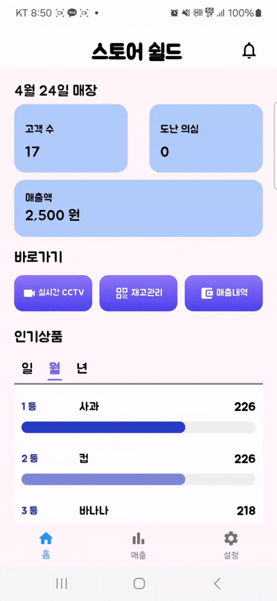
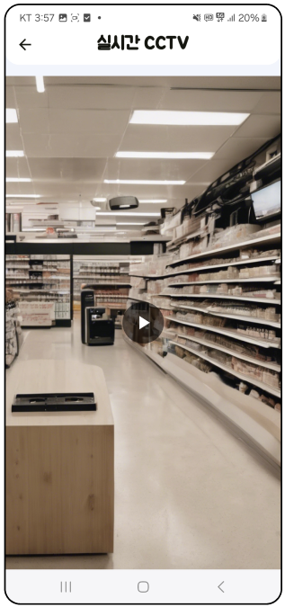
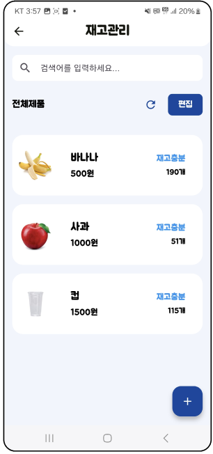
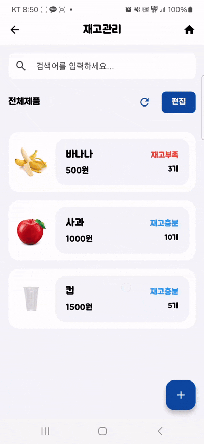
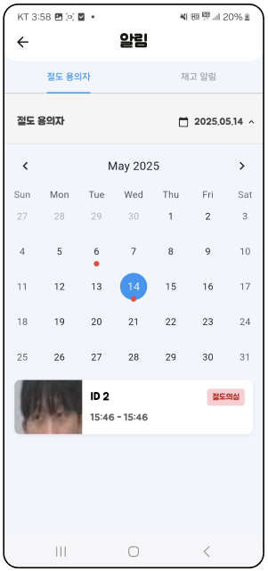
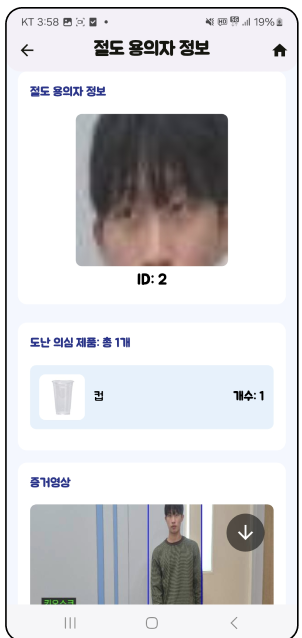
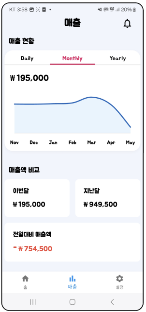
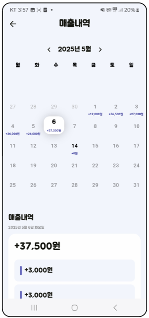
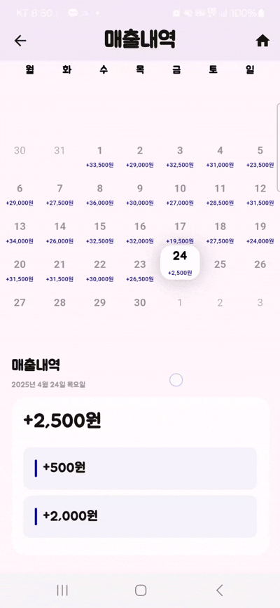
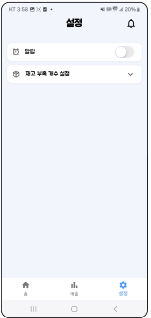

# 📱 StoreShield App

<div align="center">

**사장님을 위한 스마트 매장 관리 앱**

[](https://flutter.dev/)
[](https://dart.dev/)
[](https://socket.io/)

무인점포의 실시간 모니터링, 재고 관리, 매출 분석을 한 손에

</div>

---

## 📋 목차

- [개요](#-개요)
- [주요 기능](#-주요-기능)
  - [메인 페이지](#1️⃣-메인-페이지)
  - [실시간 CCTV](#2️⃣-실시간-cctv)
  - [재고 관리](#3️⃣-재고-관리)
  - [알림 페이지](#4️⃣-알림-페이지)
  - [매출 대시보드](#5️⃣-매출-대시보드)
  - [매출 내역](#6️⃣-매출-내역)
  - [설정](#7️⃣-설정)
- [기술 스택](#️-기술-스택)
- [역할 분담](#-역할-분담)

---

## 🎯 개요

StoreShield 앱은 무인점포 사장님을 위한 **통합 매장 관리 솔루션**입니다. 실시간 CCTV 모니터링부터 재고 관리, 매출 분석까지 하나의 앱에서 모든 것을 관리할 수 있습니다.

### 핵심 가치
- **실시간 모니터링**: 언제 어디서나 매장 상황 확인
- **직관적인 UI**: 복잡한 기능을 간단하게
- **데이터 기반 의사결정**: 매출 분석으로 전략 수립
- **효율적인 재고 관리**: 재고 부족 알림 및 자동 발주 추천

---

## ✨ 주요 기능

### 1️⃣ 메인 페이지

<p align="center">
  
  
</p>

**오늘의 매장 현황**
- 일일 고객 수 실시간 집계
- 도난 의심 건수 모니터링
- 당일 매출액 확인

**빠른 접근**
- 실시간 CCTV 바로가기
- 재고 관리 페이지 이동
- 매출 내역 조회

**인기 상품 분석**
- 일/월/년 단위 베스트셀러 확인
- 판매량 기반 자동 순위
- 막대 그래프 시각화

**담당**: 홍혜창

---

### 2️⃣ 실시간 CCTV

<p align="center">
  
  
</p>

**실시간 영상 스트리밍**
- CCTV 앱 → 서버 → Flutter 앱 전송
- 약 100ms 지연으로 준실시간 확인
- 고화질 영상 제공

**원격 모니터링**
- 외부에서도 매장 상황 확인
- 이상 상황 즉시 포착
- 화면 전환 애니메이션

**담당**: 윤현도

---

### 3️⃣ 재고 관리

<p align="center">
  
  
</p>

**재고 현황**
- 상품별 재고 수량 실시간 확인
- 재고 부족/충분 상태 자동 분류
- 검색 기능으로 빠른 조회

**상품 관리**
- 상품 추가: 이름, 가격, 재고, 이미지 등록
- 상품 수정: 정보 실시간 업데이트
- 상품 삭제: 불필요한 상품 제거
- 이미지 업로드: 갤러리에서 직접 선택

**편집 모드**
- 여러 상품 동시 선택
- 일괄 삭제 기능
- 드래그 앤 드롭으로 순서 변경

**담당**: 이선빈

---

### 4️⃣ 알림 페이지

<p align="center">
  
  
</p>

**절도 용의자 추적**
- 달력 기반 날짜별 조회
- 절도 의심일 빨간색 마커 표시
- 용의자 상세 정보 확인

**절도 의심 상세 정보**
<p align="center">
  
</p>

- 용의자 ID 및 얼굴 이미지
- 입장/퇴장 시각 기록
- 도난 의심 상품 목록
- 증거 영상 썸네일
- **영상 다운로드 기능**: 서버에서 직접 다운로드

**재고 알림**
- 재고 부족 상품 자동 감지
- 현재 재고 vs 최소 재고 비교
- 발주 필요 상품 목록

**담당**: 홍혜창

---

### 5️⃣ 매출 대시보드

<p align="center">
  
</p>

**매출 현황**
- 일/월/년 단위 매출 그래프
- 기간별 매출 추이 시각화
- 터치 인터랙션으로 상세 확인

**매출 비교**
- 이번 달 vs 지난 달 비교
- 전월 대비 증감률 표시
- 매출 목표 달성률

**데이터 분석**
- 7일/7개월/7년 추세 분석
- 꺾은선 그래프로 변화 추적
- 매출 패턴 파악

**담당**: 윤현도

---

### 6️⃣ 매출 내역

<p align="center">
  
  
</p>

**달력 기반 조회**
- 날짜별 매출 금액 표시
- 매출 발생일 파란색 강조
- 월 단위 페이지 전환

**상세 내역**
- 고객 ID별 결제 내역
- 상품별 판매 금액
- 결제 시각 기록
- 총 매출액 자동 계산

**접기/펼치기**
- 요약 정보 → 상세 정보 토글
- 깔끔한 리스트 뷰
- 매끄러운 애니메이션

**담당**: 전상우

---

### 7️⃣ 설정

<p align="center">
  
  
</p>

**알림 설정**
- 푸시 알림 ON/OFF 토글
- 절도 의심 알림
- 재고 부족 알림

**재고 기준 설정**
- 재고 부족 개수 커스터마이징
- 기본값: 5개 이하
- 숫자 입력 키패드 제공

**사용자 편의**
- 간단한 스위치 인터페이스
- 설정 즉시 반영
- 아코디언 메뉴 디자인

**담당**: 윤현도

---

## 🛠️ 기술 스택

### 프레임워크
- **Flutter**: 크로스 플랫폼 모바일 앱 개발
- **Dart**: Flutter의 프로그래밍 언어

### 상태 관리
- **setState**: 간단한 상태 관리
- **StatefulWidget**: 동적 UI 업데이트

### 네트워크 통신
- **Socket.IO Client**: 실시간 양방향 통신
- **HTTP**: REST API 호출 (매출 조회)

### UI/UX
- **Material Design**: 구글 디자인 가이드라인
- **Custom Widgets**: 재사용 가능한 컴포넌트
- **Animations**: 부드러운 화면 전환

### 데이터 시각화
- **fl_chart**: 그래프 및 차트 라이브러리
- **table_calendar**: 달력 위젯

### 기타
- **image_picker**: 이미지 선택 및 업로드
- **intl**: 날짜/숫자 포맷팅
- **url_launcher**: 외부 URL 열기 (영상 다운로드)

---

## 📊 서버 통신

### Socket.IO 이벤트
- **메인 페이지**: `hyechangPageload` → 일일 통계 및 인기 상품 조회
- **알림 페이지**: `hyechangPageload` → 절도 의심 고객 및 재고 알림
- **재고 관리**: `get_products`, `add_product`, `update_product`, `delete_product`
- **실시간 CCTV**: `image_update` → 100ms마다 영상 프레임 수신

### HTTP API
- **매출 조회**: `/api/sales/{year}/{month}` → 월별 매출 총액
- **일별 상세**: `/api/sales/day/{date}` → 고객별 결제 내역
- **영상 다운로드**: `/download_video/{customer_id}` → MP4 파일

---

## 👥 역할 분담

| 이름 | 담당 페이지 |
|------|-----------|
| **홍혜창** | 메인 페이지, 알림 페이지, 절도 의심 상세 |
| **전상우** | 매출 내역 |
| **윤현도** | 실시간 CCTV, 매출 대시보드, 설정 |
| **이선빈** | 재고 관리 |

---

## 📁 프로젝트 구조

```
StoreShield-app/
├── lib/
│   ├── main.dart                    # 앱 진입점
│   ├── mainPage.dart                # 메인 페이지 (홍혜창)
│   ├── hyundo/
│   │   └── screens/
│   │       ├── cctv_page.dart       # CCTV 페이지 (윤현도)
│   │       ├── cctv_stream_view.dart
│   │       └── sales_page.dart      # 매출 대시보드 (윤현도)
│   ├── sangwoo/
│   │   └── salesHistoryPage.dart   # 매출 내역 (전상우)
│   ├── sunbin_pages/
│   │   ├── managementPage.dart     # 재고 관리 (이선빈)
│   │   └── managementEditPage/
│   └── hyechang/
│       ├── alertPage.dart           # 알림 페이지 (홍혜창)
│       ├── suspectDetailPage.dart   # 절도 의심 상세 (홍혜창)
│       ├── settingPage.dart         # 설정 (윤현도)
│       ├── custom_bottom_navigation_bar.dart
│       ├── fontstyle.dart
│       └── hyechang_socket.dart     # Socket.IO 서비스
├── docs/                            # README 이미지 및 GIF
└── README.md
```

---

<div align="center">

**Store Shield - 스마트 매장 관리의 새로운 기준**

[](https://github.com/Store-Shield)

</div>
